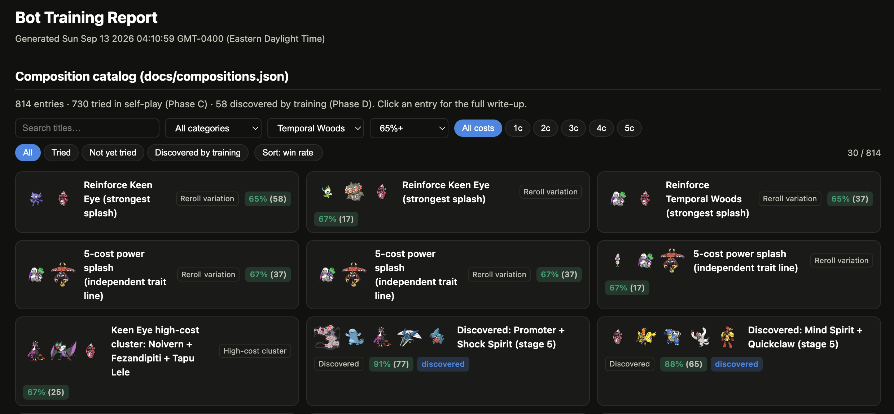
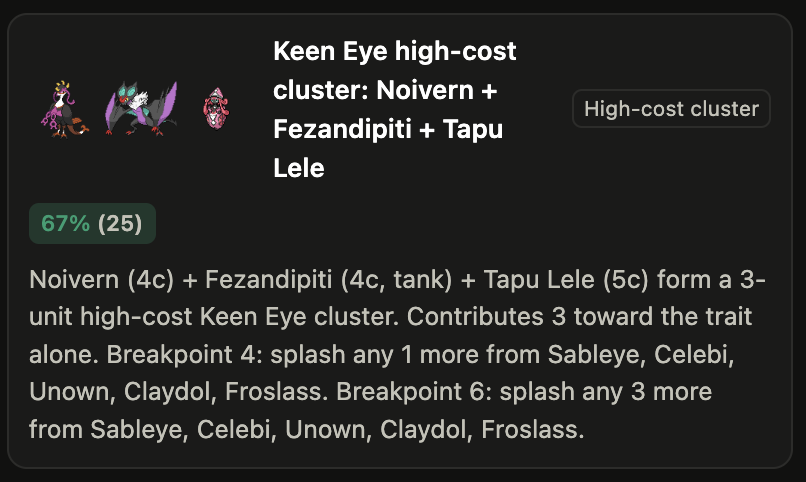

When taking a step back and looking at TFT, one of the more underrated aspects was how in any given lobby there are other people fighting for the same scraps that I need. The same units I'm hoping to hit, the same gold curve, the same window to spike before someone else does. Take that away and replace it with bots that just get stat sticks handed to them by round number, and I don't have a challenging autobattler anymore. The other five seats at the table should actually try to beat me, with their own strategies and biases. That turned out to be a much different project than the units, traits, and abilities combined, mostly because "make the bots smart" isn't a feature. It was five or six separate problems all under the same umbrella.

First I had to figure out the model I wanted to use to train the bots, since it shapes everything downstream. I realized pretty early on that a neural net making decisions was not the right choice for my scope. Partly that's practical: this project has zero runtime dependencies, runs entirely in the browser, and I was not about to bolt a GPU-trained model onto a client-side game for a personal project. From a designer perspective though, I wanted to be able to open a file and understand exactly why a bot did what it did, not shrug and point at a black box. So each bot persona is really just a genome, a set of about fifteen numbers: how much gold to keep banked, how aggressively to chase a 3-star, how much a trait breakpoint is worth, how patient to be at low health. Same brain shape for every persona, different numbers turned on the dial. Finding good numbers by hand across five personas that all have to stay balanced against each other is basically impossible, so I let them evolve instead: mutate the dials slightly, play a batch of simulated games, keep whichever version did better, repeat for generations. This is called evolution strategy, and it turned out to be a good fit, since it's a black-box optimizer that needs no gradients or backprop, just a parameter vector getting nudged and tested against a reward signal that a full game simulation already produces for free. That meant I never had to make my combat engine differentiable or build a training loop that understood its internals, and it scales down cleanly enough that tuning fifteen numbers per persona runs fine on my own machine with no GPU cluster required, while still leaving me with something I can open and read like a spreadsheet to see exactly why a persona plays the way it does.

Choosing comps and units is where the dials alone weren't enough. Each persona has a couple of "lines," trait leanings that give them a personality: one bot likes jungle sustain, another likes bulky frontlines. But a hard rule like "always buy jungle" caps a bot at whatever synergies I personally thought of, and I wanted them capable of finding combinations I never explicitly told them to look for. So on top of the dials there's a second, quieter layer that just watches: which trait pairings tend to outperform, which units tend to pull their weight when added to a board that's already leaning a certain direction, whether spreading wide across shallow traits beats committing deep into one or two. It's evidence, tracked per matchup, nudging future decisions a little more toward what's actually been working and away from what hasn't, so the bots get smarter and can explore more diverse compositions.

Choosing a path, reroll versus leveling versus the fast 8 or 9 push, is the one that most needed to not feel scripted, because a bot that always rerolls or always dumps XP on schedule is a bot you can read and exploit in about two games. So the actual level target a bot aims for isn't fixed, it reacts to the game. A bot that's healthy and sitting on gold well past its reserve threshold gets aggressive and starts burning rerolls, chasing the spike. The same bot at critically low health throws the reserve out entirely and starts spending down just to survive the next few rounds, reserve be damned. Watching that switch flip mid-game, the same persona playing patiently one game and desperate the next depending on how the actual match is going, is closer to what makes a human opponent feel dangerous than any fixed difficulty curve would be.

When to actually play a unit, bench versus board, turned out to hide a subtler problem: timing. A bot could be sitting one unit away from a real, complete composition, with that exact unit still floating in the pool, and just never get there because its leveling curve was tuned for the average case instead of its actual board. So bots had to check, live, whether they're one real piece away from a comp that's worth completing. If the piece they need is realistically still available at their next level, they'll bump their priority to actually get there instead of drifting past the window on a generic schedule. Small check, but it's the difference between a bot that assembles what it's holding and a bot that assembles what a spreadsheet said it should be holding two stages ago.

Learning what comps are actually good is where I got burned by my own data, which might be my favorite mistake of this whole project. The naive way to score a win is "this board won, so credit everything on it," but that mostly just measures which board started stronger, not which comp was good. I fixed that by scoring outcomes against what each board's raw power already predicted, so beating a stronger opponent counts for a lot and beating a weaker one barely registers, and by splitting credit among units based on what they actually did in the fight instead of handing everyone an equal share. Even after all that, I found a handful of single-copy legendary traits sitting near the top of my synergy tables with suspiciously strong scores despite doing almost nothing mechanically on their own. Turns out, it wasn't synergy. It was just "the team with a strong five-cost tends to win," and my own bandit model had been quietly rewarding it as if it were a real combo. Chasing that kind of thing down, the gap between a bot that looks smart and a bot that's fooling itself with bad data, has taught me more about this whole system than building it in the first place did.

All of that evidence has to go somewhere I can actually look at it, which is what the training report is for. The centerpiece is a browsable catalog of every composition the bots have tested, some hand-authored entries I designed myself sitting next to ones the bots found completely on their own. My own entries get annotated with a real measured win rate and sample count from self-play instead of staying theoretical, colored green when they hold up and red when they don't. The bot-discovered ones are the part I actually check first: when the exploration layer stumbles onto a trait pairing that's quietly outperforming and it isn't already in my catalog, the pipeline tags it "discovered," timestamps it, and drops it in next to everything I wrote. It's filterable by trait, cost, and win rate, sortable by how well something's actually performing, so with a few hundred entries in there I can go straight to what's winning that I didn't put there myself instead of reading through everything by hand. This way, bots can make their own meta decisions based on experience without me needing to hold their hand and tell them what compositions and units are good.

*814 entries deep, 58 of them the bots found without me pointing them there.*

*The full write-up behind one entry, which units anchor it and what to splash in next.*

None of this makes the bots unbeatable, and that was never the goal. The goal was a lobby where losing feels like someone out-drafted you, not like the game decided it was your turn to lose. Getting there meant treating bot difficulty as a research problem, exploring the different avenues of gameplay, and coming to conclusions about what a human player would think, then turning that into something bots could do themselves.
