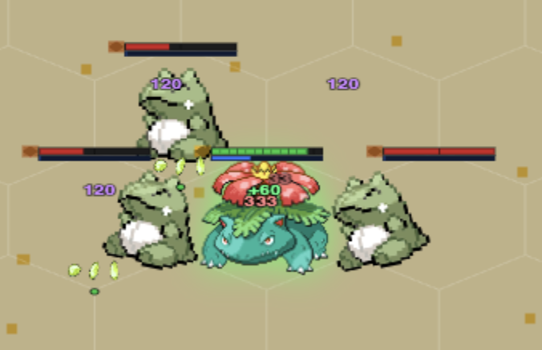
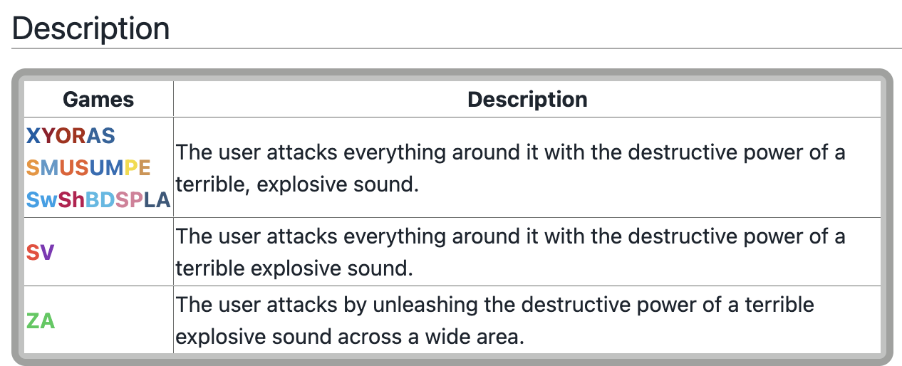
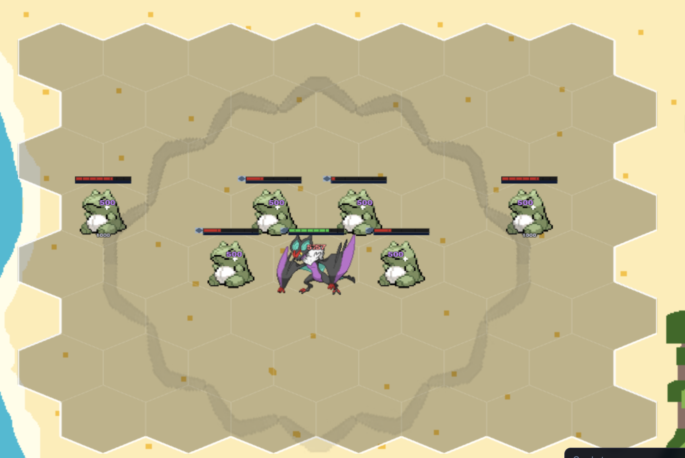

Designing the abilities (spells) of each Pokemon is where I really got to nerd out. With a world as big as Pokemon, there is inspiration from everywhere, and I wanted to make decisions that paid homage to the preexisting aspects of the game. This was the design challenge I was faced with: how do I pick and choose parts from a turn-based RPG and translate them into a live, combat-based system. I learned that I needed to establish a baseline to work off of. I felt like Professor Oak, meticulously scanning through Pokemon movesets and abilities for each of my units until I found something that could reasonably translate to an autobattler or was too iconic not to associate. Pokemon in the RPGs get to have 4 moves, and you can tweak them throughout your playthrough. In this game, each Pokemon can only do one thing, so I had to be methodical and choose what I felt best aligned with the archetypes I wanted my units to fit into.

The spell defines what role the Pokemon takes: tanks would cast shields and heal themselves, spellcasters would let off elemental blasts, marksmen would empower auto attacks. Let's look at an example with Venusaur. I knew Venusaur would be an early game tank for Jungle. Looking through its moves, Leech Seed stood out, as it enabled Venusaur to take on the unique role of a drain tank, stealing health from enemies around it to keep itself alive.

*Leech Seed, live: three enemies bleeding health at once, Venusaur topping back up off the drain. One move from the games, one sentence of flavor text, and the "drain tank" role just falls out of it.* I tried to keep lower cost units with simpler spells, such as simply empowering an auto attack or a simple shield. Higher cost units got more complicated spells with additional effects, such as crowd control or more explosive damage.

What I found really helpful was the flavor text of moves and abilities. Oftentimes in the games, especially as I got more into the competitive battling aspect of Pokemon, I was really only looking at base power and move effects, clicking a move because of a big number. But now the flavor text of moves and abilities was giving me inspiration. Let's take the move Boomburst for example. From the Pokedex: "The user attacks everything around it with the destructive power of a terrible, explosive sound." What are the key takeaways here? Destructive power, so this would probably work best as a powerful spell on a higher cost carry unit. The user attacks everything around it, so it's a natural fit for a wide area of effect ability. This became Noivern's spell, releasing a shockwave dealing massive damage to all units surrounding Noivern within a certain radius. Researching move and ability effects and flavor in the games guided me and helped me choose moves that reflected the elemental powers Pokemon have and pick the right one for each Pokemon.

*The actual flavor text I was reading. "Attacks everything around it" and "destructive power" did most of the design work before I wrote a single number.*

*And here's the payoff: Boomburst as a radius nuke, tested against a ring of dummies so the AoE shape is the only variable on screen. This is what "the user attacks everything around it" turns into once it has a hitbox.*

Eventually, I found myself in a rhythm, picking three to five possible moves for each Pokemon and comparing them to what I already established, what fit thematically, and what was missing in archetypes. Each decision was backed up by direct references from the mainline games, so the connection between Pokemon and move felt natural. It also helped to stop and think of Pokemon as mythical animals at their core. Vigoroth, being an energetic and frantic jungle creature with sharp claws, would naturally furiously swipe at its enemies, thus landing Fury Swipes as its move. But let's go one level deeper: being a monkey/sloth like creature, Vigoroth likes to hang from branches and swing from trees. I took that idea and translated it into Vigoroth dashing at his target to attack. This approach helped the Pokemon feel more real in the world of my set, and also encouraged me to think of creative gameplay to match the behavioral patterns of the Pokemon in their environments.
