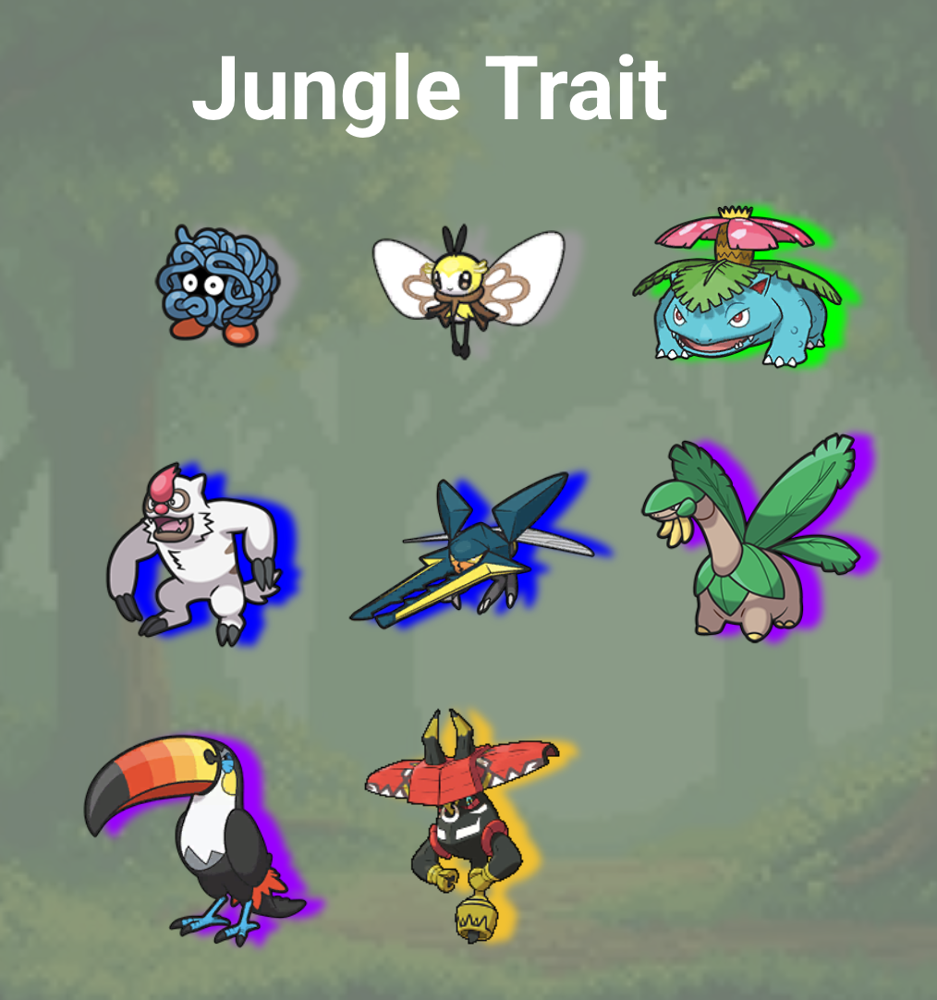
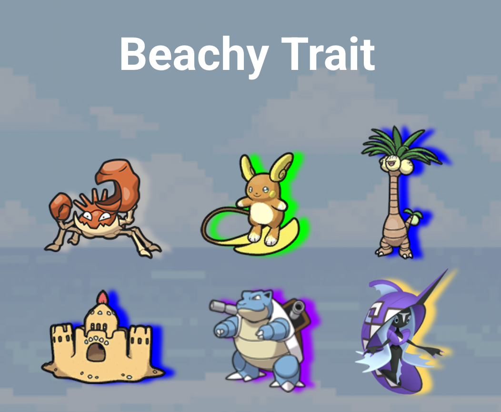
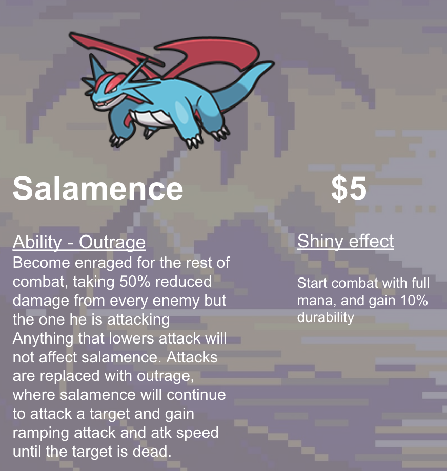

With the theme settled and the traits defined, the next design challenge I had was choosing the actual Pokemon to be the units for the set. This turned out to be a lot harder than I anticipated. I thought that having so many options would make it a breeze, but if anything the overwhelming number of choices made it that much more important to pick the right ones. I knew I wanted a mix of Pokemon from different regions, and I knew I wanted a mix of the classics and more obscure Pokemon. A core principle of Pokemon is that every Pokemon could be someone's favorite. Especially in an autobattler based on Pokemon, players are likely to play comps that involve their favorite Pokemon. I wanted to cast a wide net. Of course I had the fan favorites, the Kanto starters, Rayquaza, Pokemon that are regularly plastered on merchandise and have mass appeal. But choosing the niche Pokemon is where I had the most fun. When was the last time you thought of Stonjourner or Fezandipiti? If you ask a casual fan, they might not even know who these Pokemon are. That was really exciting for me, as a fan of the franchise I wanted to give recognition to some of the overlooked creatures in the series.

As I was thinking, I couldn't help but appreciate the process of making my set. Starting wide from the theme and drilling down bit by bit made design decisions feel guided. The different environments gave me great direction, and instead of a game designer I got a chance to put on my biologist hat and start thinking about which Pokemon would live in the environments I had defined. Part of game design to me is being able to switch between a wardrobe of hats, thinking from new perspectives in order to make my game feel fleshed out and carefully thought out from every angle.

*The biologist-hat exercise made visible, sorting candidates by habitat before a single ability existed.*

Most of my process involved pulling up the Pokedex on screen and pictures of environments on the other, scrolling through slowly and asking myself if it would make sense to encounter this or that Pokemon in the region. Slowly but surely, it became a natural process. Weezing would be found inhabiting the sulfuric air that surrounds volcano mouths. Vigoroth would be swinging from vine to vine in dense jungles. Kingler scuttling around the shore. Talonflame swooping and piercing through the air above. A lone Quagsire lazily floating down the river, not a care in the world. I came to realize the most important thing to me about choosing the units was not just picking the cool Pokemon that people know and love. It was about picking Pokemon that, if I was dropped into their environment, I wouldn't be surprised to see. Not everything had to be a rare species, squirrels are just as quintessential to the forest as bears are.

As I kept putting Pokemon in different buckets, the Isle of Imagination began to truly take shape. The biologist hat came off, and now I was back to focusing on something that I believe is what makes the units of TFT and autobattlers successful. Do they feel right in their place? That doesn't just mean do they fit their trait, it also means do we have diverse archetypes of units, like tanks, spellcasters, marksmen, and does a one cost feel like a one cost. Take Zubat for example. One of the game's most iconic Pokemon, known for constantly showing up in caves every step you take. Zubat, common, one cost, check. But that gets harder for each tier of units. Spiritomb, a fan favorite for its unique lore and design, made sense to me as a four cost unit, translating the feeling of power and intrigue associated with it into a core part of the gameplay. The dainty Froslass would be a backline spellcaster of its trait, and the big bulky Mamoswine would be the main tank.

Designing 5 costs was its own unique challenge. These units needed to feel legendary, sometimes literally. Classic legendary Pokemon such as Latios and Latias felt like natural inclusions. 5 cost units must also stand out, sometimes because of their weirdness. Runerigus as the 5 cost for the Ruiner trait was one of my favorite decisions, including what I think is one of Pokemon's most creative creature designs. And since this started as a personal project for me, I allowed myself a little bias. Salamence is my favorite Pokemon, so I made Salamence a 5 cost. Then the paradigm became making Salamence feel like a 5 cost, so I gave him his own unique trait and an ability that makes him one of the strongest attack carries in the late game.

*The design card that came out of pure favoritism, built until it actually felt like a 5-cost.*

The process of choosing Pokemon is where I really started to see my set begin to breathe and take life. They provide the true baseline for the game, and jumpstarted everything else that came afterward.
