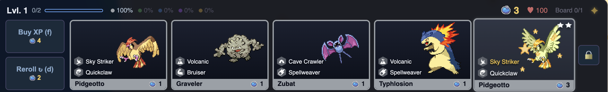
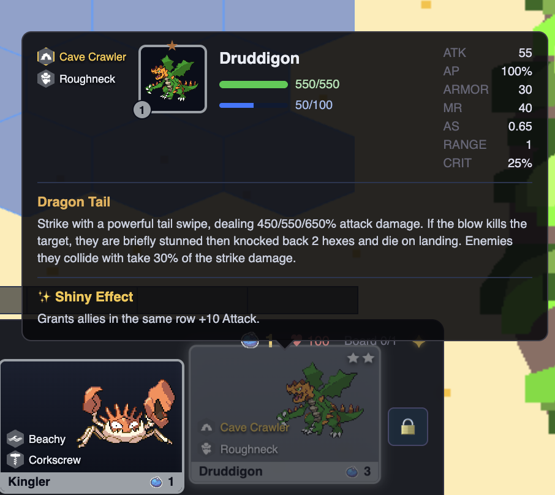

Once I had the base parts of my autobattler fleshed out, I knew the next thing I wanted to do was include a unique set mechanic. When playing TFT, set mechanics would be a big part of the reason I grinded certain sets versus others. Dragons, Headliners, and Augments, to name a few, were intriguing hooks that added a new layer of complexity to the games that I really enjoyed. They helped each game feel different, and added a degree of randomness that truly made no two games feel the same. Pokemon is a series full of generation gimmicks, so the trick here was choosing one that felt right for my theme and made sense for the gameplay.

Originally I looked at some of the battle mechanics that different main series games introduced. There was Mega Evolution, Dynamax, Terastallization, Z-Moves, and more, but each one just didn't feel right. Most of these mechanics had in-game reasons for existing, something in the lore of the game that explained how they came to be, so they felt out of place in an autobattler that was separated from the storyline the games were trying to tell. Mega Evolution was too specific to certain Pokemon, and I didn't want to limit my options. I realized it had to be something broad, something every Pokemon fan knows, that every Pokemon could have.

I thought back to my fondest Pokemon memories for inspiration, and one clearly stood out from the rest. Encountering the red, shiny Gyarados at the Lake of Rage for the first time. This was it. Shiny Pokemon are such a quintessential part of the Pokemon gameplay experience that there's a cult following around solely collecting them. And it fit within the theme of my set. Encountering rare, shiny Pokemon hidden deep in their habitats on the expanse of the island was a logical jump. Every Pokemon could be shiny, which fixed my scope concerns. Now it was time to figure out how to take shiny Pokemon and make them an interesting gameplay hook.

*The shop-side tell: everything else in this roll is a plain one-star unit. The shiny Pidgeotto on the right showed up already two-starred, shimmering, and impossible to miss.*

After deliberation, I decided I didn't want to reinvent the wheel. I had been working on the set for a few months now, and my main focus was getting the game to feel balanced and polished. A crazy complex mechanic could have been fun to design, but I had to be reasonable with the time I had and where I wanted to put my effort. So I took direct inspiration from my all time favorite TFT mechanic: Chosen units. Units that have a chance to appear in the shop already 2 starred, contributing twice to one of their traits. It fit the idea of a rare occurrence popping up in the shop, with players digging through trying to find the perfect one for their comp. Being honest, it was almost a perfect fit for shiny Pokemon to function the same way.

I did want to add one caveat though. I gave each shiny Pokemon its own unique buffs, in order to add another level of complexity and another lever to balance around. These ranged from team wide buffs, like shiny Tropius granting the whole team +100 base health, to individual ability buffs, such as shiny Typhlosion's Eruption causing a new burn effect on affected enemies. My thought behind these buffs is that it would cause players to be more careful about choosing their shiny Pokemon for the game, and introduce a new layer of decision making. Did they want the shiny that buffed their team, or one that contributed to a trait breakpoint they wanted to reach? Did they want a carry unit that could utilize their items, or did they desperately need a frontline with a strong shiny tank? Those are the types of decisions that help make games feel distinct, while still enabling the player to have autonomy and play the way they want to.

*Every shiny gets its own line in the tooltip, right below the base kit. Druddigon's happens to buff its whole row, which is exactly the kind of extra lever that turns "do I want a shiny" into "which shiny do I actually need right now."*

With that, I had my set mechanic mapped out and ready to implement. Now all the groundwork was done, from theme, to unit design, to gameplay hooks. From here I'll be working on implementation, UI building, testing, bug fixing, and everything else that comes along with this journey. It is time to take this from an idea on paper and turn it into a proper, playable game that I could balance and see in front of my eyes.
