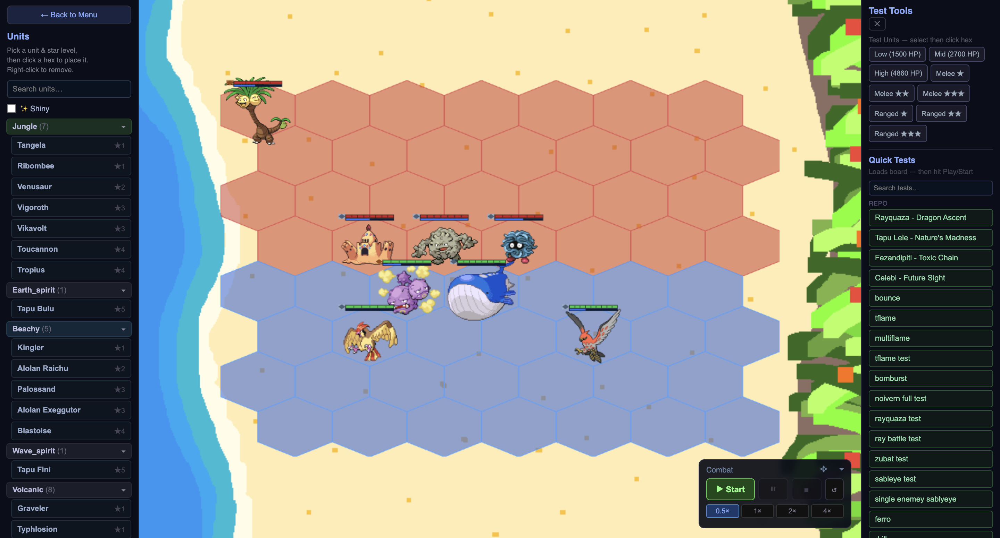
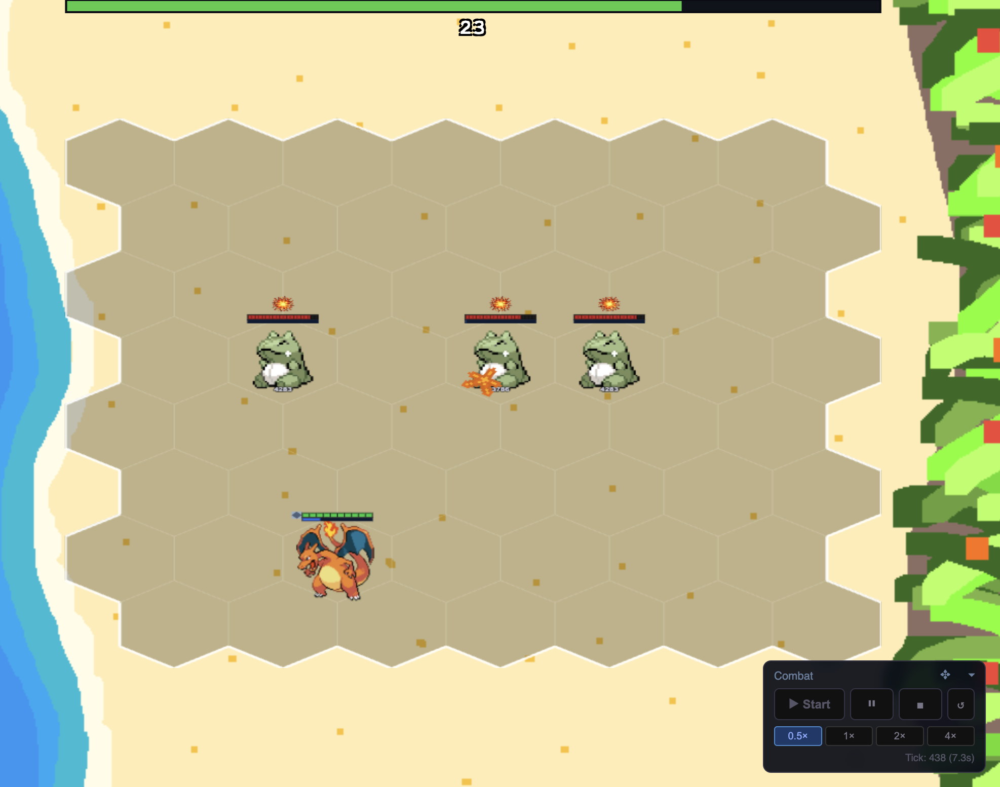

Everything I built for the bots, the training loop, the credit scoring, the composition catalog that grows on its own, answers one question well: what wins. None of it answers whether something is actually fair to lose to, or satisfying to pull off, or even readable while it's happening. A composition can sit at an earned 90% win rate and still be the kind of fight that's confusing to watch, over before the player can react, or just flat unpleasant to be on the other side of. Numbers tell me the outcome. They don't tell me the experience, and the experience is the thing I actually care about most. I needed a way to take something the data pointed at and put it directly in front of my own eyes. To me, the most important part of any game is how it feels. Results should feel satisfying and earned, and I needed a way to connect what the data was showing me with real player perception so I could adjust the invisible feel value that can make or break a game.

That's what I developed test mode for. One toggle strips away the shop, the gold, the XP curve, everything about the economy loop, and leaves just the board. I can place any unit at any star level on either team. I get to control the speed of combat, pause, step through slowly, or jump to four times speed, so I can watch a single moment frame by frame or blow through the boring middle of a fight to get straight to the part I actually want to see. The whole thing is built around isolating one question at a time instead of playing a full game to indirectly find out the answer. This way, I can take the insights from data and see them unfold in front of my own eyes.

*The unit picker, dummy spawner, and speed controls, all in one screen: the toolkit built for exactly that kind of isolating.*

Sometimes I don't even want a real opposing comp. I just want a stable target I already understand completely, so I built dummy units, plain melee and ranged punching bags at each star level, that never do anything unexpected. If I want to know exactly how hard one ability hits or how fast a unit actually kills something on its own, a real enemy comp adds its own randomness on top of the thing I'm trying to measure. A dummy removes that variable entirely, so whatever I'm watching happen is really just the one thing I put there.

*Charizard alone against three dummies, nothing else on the board: exactly the isolated read a real enemy comp would never let me get.*

The moment I find a matchup worth checking again later, I can save it. With a click I can snapshot the exact board, both sides, every unit's star level and position, and I can reload that same matchup instantly instead of rebuilding it by hand each time I want another look. A five-second "let me check this" moment turns into a regression test, which is exactly the kind of quiet quality-of-life win I keep chasing for myself as the only person maintaining this project.

This is also where the training report actually earns its keep. When the catalog turns up something like a discovered pairing sitting at a strong win rate over a real sample size, I don't have to just trust the number. I can build that exact board, set it against whatever I'd actually expect to face at that stage, and watch it happen. A win rate can be completely correct and still look wrong the moment I see it play out, too slow to matter, too easy to punish, over in a way that doesn't feel like it earned the win. Watching it is the only way I catch that gap, and it's a gap no amount of additional simulated games would ever show me on its own.

The data tells me where to look. Test mode is how I actually go look, and it's what I use to verify results and tweaks.
