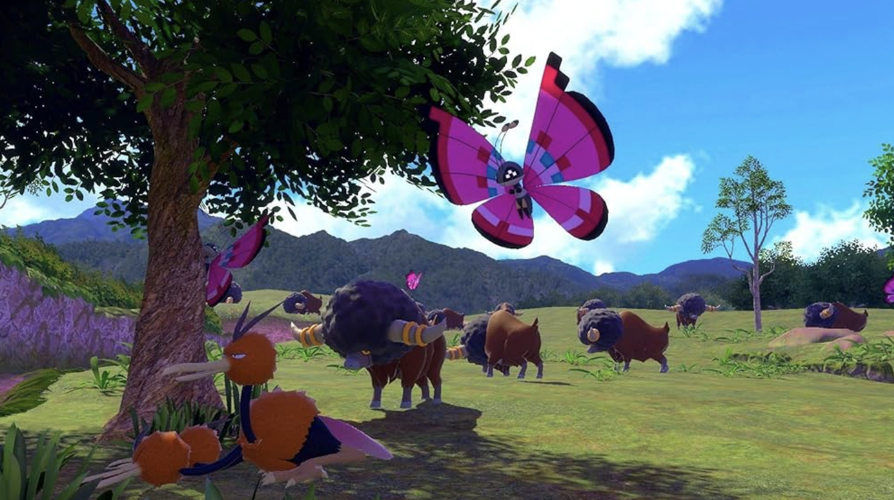

The driving force behind designing any game is its theme. What is the vibe we want to give off? Is it adventurous and serious? Is it whimsical and magical? For an autobattler, it inspires the units, the traits, the spells, everything downstream. Before I could think outside the box, I needed to define the box in the first place. A theme gives direction, but it also imposes limits, and those limits are exactly what force me as a designer to get creative.

When I was ideating on my own set, I wanted a theme that wasn't overly restrictive. Two obvious options came up first and both got cut. An elemental set (fire types grouped together, water types grouped together, and so on) felt like the natural fit, since Pokemon typing already handed me a built-in trait system for free. But with only 18 types to pull from, it's too narrow: I either ended up with shallow trait pools, or I stretched a single type thin across dozens of units until "fire type" stops meaning anything mechanically or thematically. Region-based sets (Kanto, Johto, Hoenn) solve that flavor problem, but trade it for a scope problem. Locking to one region capped me at around a hundred Pokemon to choose from and, worse, forced the set's mechanical identity to match whatever archetypes that generation happened to ship with, rather than what the set actually needs. With over a thousand Pokemon to draw from, settling on a single region felt like leaving most of the roster on the table.

For inspiration, I looked back through my own playing history and kept landing on the same two games: Legends Arceus and Pokemon Snap. Both put Pokemon in real wild habitats, letting them interact with each other and their environment in ways the mainline games don't emphasize. Honestly, the seed was there long before those two. I'd always liked how the mainline series clustered certain wild Pokemon on certain routes: tentacool and staryu off the coast, geodude and zubat deep in a cave. That wasn't just an encounter table, it was worldbuilding. You learned what kind of place a route was by what lived there, before a single line of dialogue told me anything. Legends Arceus and Pokemon Snap just took that idea and put it front and center: a slowpoke sunning itself on a riverbank, a pack of stantler moving together through an open field. It wasn't the Pokemon themselves that stuck with me, it was how they made the world around them feel lived in. I didn't want to build a roster. I wanted to build a place, and let the roster fall out of it. So I did. Welcome to the Isle of Imagination, the theme of my autobattler.

*Legends Arceus doing exactly the thing I wanted to steal, grouping by habitat instead of by generation.*

*Pokemon Snap chasing the same feeling, a real place first, with the roster just living in it.*

The set centers on the diverse ecosystems Pokemon are found in: one island, home to Pokemon pulled from every generation, with each region of the island hosting its own distinct micro-ecosystem. Traits are built around those environments (jungle, volcano, beachfront, ruins, and so on) instead of around type or region. That's the actual design payoff of the theme: grouping units by where I'd find them, instead of by what they technically are, opens up combinations a type-based or region-based set can't reach. A flying-type and a rock-type can share a trait if they'd both plausibly live on the same cliffside, and I found that to be a far richer design space than "these are both flying types."

When designing, my takeaway was that a theme's job isn't to just describe my content, it's to constrain the design space in a meaningful way. Elemental and region-based themes failed for the same underlying reason: both borrowed a taxonomy the games had already built for me, instead of forcing me to invent one that actually served the set. The environment-based approach worked for me because habitat isn't a category Pokemon ever directly handed me, it's one I had to design myself, which meant every trait boundary was a real decision instead of an inherited one. Everything else, the traits, the synergies, the units, flowed from that one choice.
