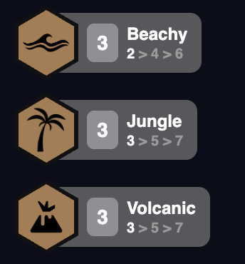
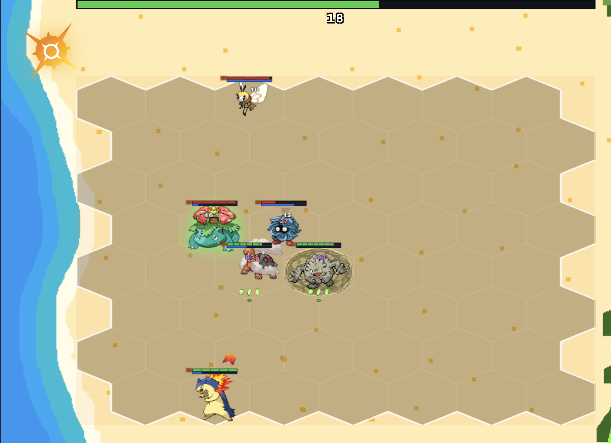

The theme helped guide the design of my set. But a theme alone doesn't guide gameplay and fulfill player fantasies. That's where trait design lives. I ran into the same problem here that I ran into picking the theme itself, just one level deeper. Keying traits to type was the obvious shortcut for the same reason an elemental set was: Pokemon typing handed me a built-in grouping for free. But a type tells you what a unit is, not what happens when you build three of them. "Fire type" as a category felt boring, and frankly uninspired. It isn't a mechanic, and it isn't a reason for a mechanic to exist. Basing traits off of environments gives me both, and challenged me to think in a new design space.

So the first actual design pass started with mapping biomes: picking environments that don't step on each other, so each trait owns its own identity and clearly differentiates itself from the others. I spread them across climate (tundra, volcanic heat), altitude (a cave floor, a cliff face, open sky above that), water sources (a river versus a coastline), plus a couple of environments that I took some creative liberties with. The test for whether an environment earned a slot was simple: does it suggest an interesting mechanic that nothing else on the list already owns. If two environments would both just deal damage over time with a different coat of paint, one of them doesn't belong. Below are a few of the traits I decided on, with a deeper look at my rationale behind each.

*How a trait actually reads in-game: an icon, a habitat name, and the breakpoints that turn it on. Everything below is the reasoning behind what each of these actually does when it lights up.*

Jungle was the easiest, and the one I used to baseline the rest. To me, when I think of a Pokemon jungle, I see plants growing rampant and unchecked as the Pokemon make the trees and alcoves their home. I knew I wanted to keep this trait simple, so I translated the idea of continuous growth into leaning on keeping units alive longer. Jungle units boost healing and shield power for the whole team, with a bigger bonus for Jungle units themselves, using the unchecked growth of a wild jungle to benefit their own team.

For Beachy, I wanted something that embodied the surfer vibes of living stress free by the beach, not just a single stat that sits there being passively good. Beachy units get a flat pile of bonus HP, sure, but the real hook is that every cast builds up "beachy vibes," and those vibes make the next cast stronger. Casting isn't just casting on this trait, it's paddling out and catching the next one a little better than the last. My favorite design choice of this trait was naming a stack "vibes" instead of "stacks." It's a minor thing in retrospect, but I found that it's the difference between a trait that has flavor text and a trait that is the flavor.

Volcano is where I wanted to explore a different mechanical hook: delayed gratification. A volcano spews smoke before it violently erupts. I also took this chance to add a nod to another one of Pokemon's core battle mechanics, setting weather. Volcano units get HP and adaptive force, and after a delay they summon the sun over the whole board, at which point everyone's Volcano bonuses jump by half again. This makes Volcano Pokemon weaker at the start of the fight, but gives them a jump in the middle if they can survive long enough and take advantage of the summoned sun. Part of the challenge for me in designing traits was giving them different hooks and levers I could adjust to further differentiate them from other traits. For Volcano, I found that tinkering with timing helped break up the flow of combat in a satisfying way.

*The sun's up. Every Volcano unit on the board just got its second wind, mid-fight, which is the entire point: reward the team that survived long enough to see it happen.*

River is the one that took me the longest to get right, because my first pass was just "River units get tankier/stronger," which is true of about six other traits already and says nothing about a river specifically. This is where I really began to think outside of the box I'd defined for myself. I took a step back and asked myself a basic question: what does a river do? It flows, moves, bringing life along with it down the stream and by the banks. That was my base, so then I thought about how to translate this "flow" aspect into a mechanic. So instead of a flat team buff, I made the strongest River unit on the board carry Aqua Ring, a chunk of durability and lifesteal with a death nova, and when that unit dies, the ring doesn't disappear. It passes to whoever's left. The mechanic isn't just the stats, it's in the spread and hop of power throughout River units. This fulfills two different player fantasies at once, one about buffing up your strongest unit, and one where multiple strong units all benefit from a central buff in turn.

Ruiner is the odd one out on purpose. Every environment above it is a living place, something with weather or water or growth. Ruins are the opposite: something old, built, and abandoned, and I wanted at least one trait on the island that wasn't nature doing its thing, one that leaves some mystery in the lore. Ruiner doesn't actually help any of the Ruiner units themselves. It triggers when your own team takes twenty percent of their total health, waking up an ancient golem to help your team get back into the fight. Golett first, then a Golurk, then a full Mega Golurk at the top end. The Indiana Jones movies I watched as a kid always warned me not to mess with ancient ruins, lest some unknown evil wake up, and I wanted something like that in my game. I've always liked the summon traits in TFT, so I made sure to include one in my set as well, and Ruiner felt like the perfect place to do so.

The most important thing to me was that when I laid all five traits next to each other, the actual throughline isn't the environments, it's that none of them were a stat buff wearing a location's name as a costume. Each one's real payoff is doing something that the nature of the location suggests: growing, surfing, erupting, flowing, waking up. I found that keeping that throughline in mind made the traits feel more fleshed out and unique, and preserved the notions the different locations of the island are meant to invoke.
