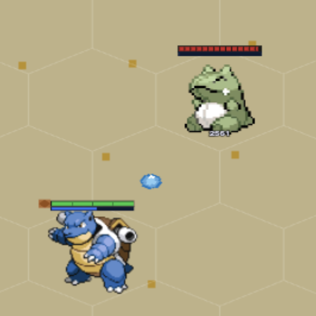
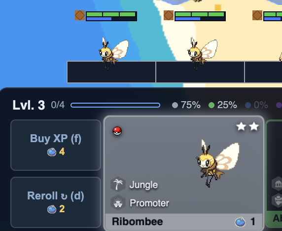

Once the theme, traits, units, abilities, and shiny mechanic were all mapped out, I had a game on paper that actually worked. What I didn't have yet was a game that felt good to sit down and play for twenty rounds in a row. Here's the thing about an autobattler: almost everything I designed up to this point only matters if the player can actually see it and act on it fast enough to matter. TFT lives and dies on its planning phase timer. You've got thirty seconds to reroll, buy, position, and move on, and if the game makes you stop and do math or go hunting for information, that timer beats you before your opponent does. So a good chunk of my UI work wasn't about adding features. It was about noticing where I, playing my own game, kept getting stuck for a beat too long, and figuring out why something felt off.

Take the pixel art. In the mainline games, most Pokemon share the same generic swipe or tackle animation for a regular attack, and all the identity lives in the moves. I wanted the units to feel more alive in my game, so every single auto attack in the game is hand drawn, instead of reused across the roster. At first I wondered if it was too much effort to spend on the most boring action in the game, since units throw out dozens of auto attacks during a fight and it's usually the least interesting part of a unit's damage. But the first time I swapped a placeholder generic circle for a bubble of water launched from Blastoise's own stance, the unit stopped feeling like a stat block wearing a costume and started feeling like Blastoise.

*The swap that did it, a water bubble instead of a generic circle, on every single auto attack.*

Multiply that by the whole roster and the game crosses the invisible line from programmer art with numbers behind it to something that actually looks alive. I realized in my playtests that nobody consciously notices a good auto attack. They just stop noticing the bad one, which helps the game feel more polished.

Abilities had a different problem: telegraphing intent instead of establishing identity. Every spell in the game comes straight from a Pokemon's moveset, which reads as flavor on a design doc, but in live combat you only get a fraction of a second to read what's about to happen before the effect fires off. So I went back through every ability, one at a time, and built a cast animation that actually matched what the move implies. Weezing doesn't just deal damage on cast, it squishes and stretches as it billows poisonous smoke, because that's what it's threatening. Gogoat doesn't just stand there and cast, it hops forward with empowered attacks, because it's a goat lunging headfirst at its target. That's a lot of individual, unglamorous work for effects most players will only half register mid fight, but that's exactly the tell that it's working. Building out the ability animations taught me that when an ability's visual cues go from just decorating the damage number to telling me something true about the Pokemon casting it, players start reacting to the cast itself instead of only the result.

Designing the shop cards from scratch taught me a different lesson: a tiny addition can remove a surprisingly large amount of mental overhead. Buying a unit that completes a 2-star or 3-star is one of the best feelings in the genre, but figuring out whether a card in the shop would trigger one meant counting copies on your bench in your head, every single reroll. That's not fun thinking, it's bookkeeping, and it was happening dozens of times a game without me ever noticing it as a problem until I watched myself doing it. The actual fix was one visual rule: a card that completes a 2-star glows silver, a 3-star glows gold, before anything is clicked. Nothing about the shop's logic changed. But an entire category of math just disappeared from the player's head, and the payoff went from something I need to calculate to something I can see coming.

*Ribombee's shop card already glowing to signal a 2-star: the one-rule fix in action, before you've even done the bench math.*

Then there was the issue of showing, not telling, when it came to core game mechanics. I never wanted a confirmation popup for buying a unit or spending gold, since that's exactly the kind of extra friction that fights the smooth pacing I was trying to build. But that meant every action needed some other way to confirm it landed, or the game starts to carry this nagging feeling of "wait, did that actually work?" So a held unit shakes and flashes red if you try to shove it onto a board that's already full for your level. The gold icon pulses when you spend or gain. Units on the bench briefly rumble and glow when they star up. Each one is a half-second animation, but together they quietly stand in for an entire layer of feedback that keeps the player informed and aware of their board state.

Looking back, almost none of these came from a checklist. They came from actually playing my own game, over and over, and paying attention to the specific moment my eyes went looking for something that wasn't there, or my hands did math the game should've done for me. That's the real lesson of this whole stretch of work: the size of a fix has almost nothing to do with the size of what it's protecting or removing. A hand-drawn attack frame that nobody consciously notices is what makes a unit feel real instead of generic. One glow color deleted a whole habit of mental arithmetic. I didn't find any of that on a design doc. I only found it by playing the game myself and noticing where I flinched. After all, the best way to learn is to do it over and over again, noticing the new challenges each time.
