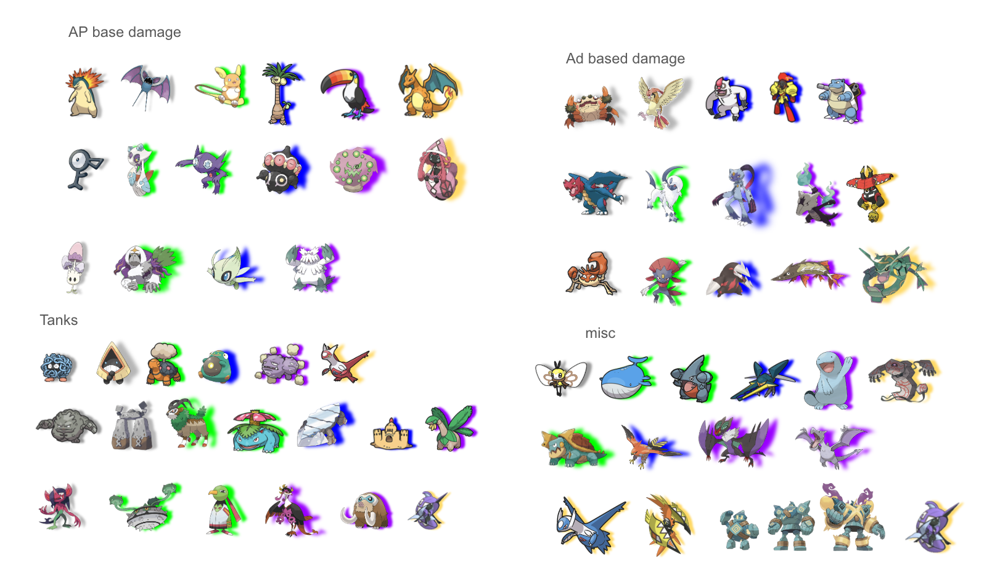
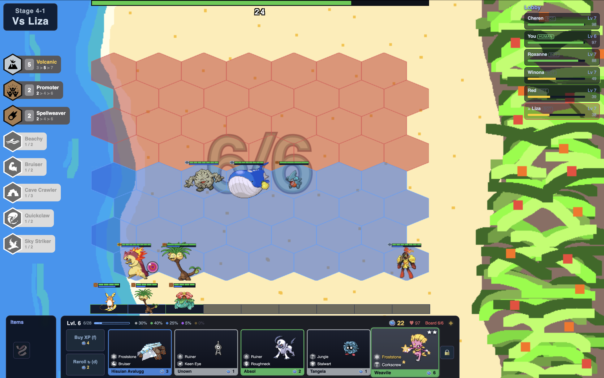

I've been playing Teamfight Tactics since the day it launched, and I fell in love with the game over the course of the first set. As a seasoned Summoner's Rift player for four years at that point, I loved seeing how TFT translated champions from their MOBA kit into something that felt right at home in a whole new genre. Who could forget double Seraph's Embrace Katarina jumping to the backline and insta-ulting to shred carries to bits? TFT took my appreciation for League of Legends and its diverse world of champions and items, and gave it a new avenue.

I've been playing Pokémon since I learned how to read. My childhood largely consisted of getting every Pokédex handbook I could get my hands on, and watching the show for hours at a time with my brother. I'll always have a deep appreciation for the franchise, though as I got older, the standard turn-based RPG games started to lose their charm for me. Games like Pokémon Snap became my favorite since they broke the mold of what a Pokémon game could be yet still sustained the distinct Pokémon design and lore.

On long road trips, my brother and I would often play a game where we had to turn a Pokémon into a league champion (this was before the days of Pokémon Unite). We'd sit in silence for a few minutes, choosing roles that made sense to us: Snorlax would be a tank, Blastoise an ADC. Abilities came next, from passive to ultimate. Naturally, once TFT came out and we were both playing every night, the question shifted: what if this Pokémon were a TFT unit? What would its ability be? What role would it fit, and what traits might it have?

It eventually became a question I'd ask myself as I fell asleep at night, letting my imagination run wild. Days turned to months and months turned to years, but as technology progressed and I studied TFT more and more, I knew it was time to make those daydream thoughts a reality. This set is simply the combination of two of my favorite games. Beyond ideation on paper, I want to create a fully functioning game that, if no one else plays, at least I will.

*Before there were units, there was this: every Pokemon I was considering, sorted into rough combat roles. Half of this board didn't survive contact with actual design work, but it's where the roster started.*

Now, I understand this isn't a novel concept. Just look on Reddit for a bit and you'll find others with their own documents listing potential Pokémon autobattlers. But I wanted more than a paper version. So over the next few months, I'll build my very own Pokémon autobattler, complete with functioning units, economy, traits, and more. Along the way, I'll be learning from the ground up how an autobattler functions and what makes a successful version like TFT so well polished.

This post is the first in a devlog series documenting that process. Future entries will dig into the specifics: set design, unit design, UI design, mechanic design, and whatever else comes up along the way.

*Where that sorting board ended up: a real match, real bots in the lobby, a real shop to make decisions in. Everything else in this series is the story of how it got from the image above to this one.*
